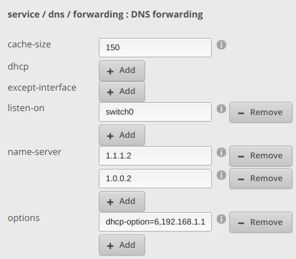
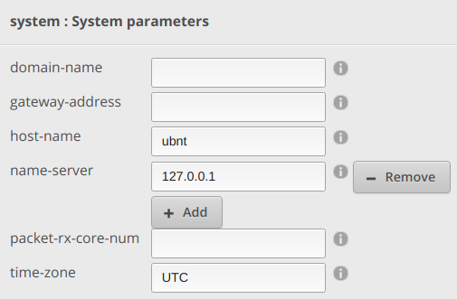
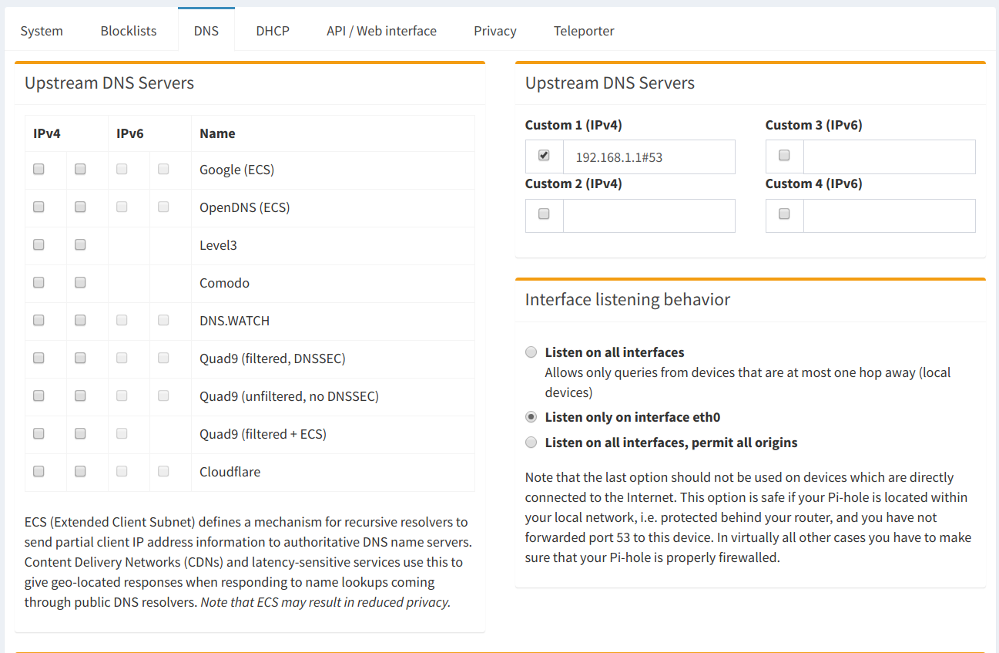
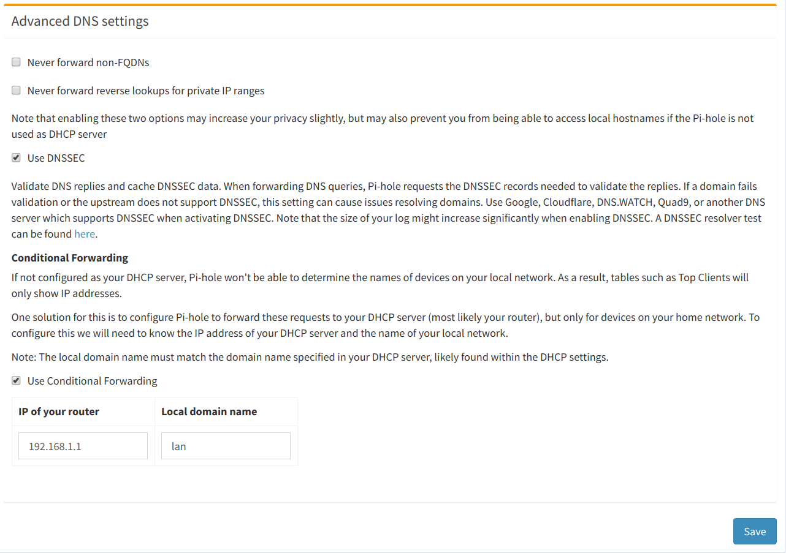

# Configuring Pi-Hole properly with dnsmasq

This documentation is expanded from [the pihole discourse docs](https://discourse.pi-hole.net/t/how-do-i-configure-my-devices-to-use-pi-hole-as-their-dns-server/245).  That document is great, but if you aren't already familiar with [dnsmasq](http://www.thekelleys.org.uk/dnsmasq/docs/dnsmasq-man.html) it may be confusing.

IMO, this is the **most proper** method of configuring a pihole.

## Goals

* to automatically configure DHCP clients to use a local pihole for DNS
* to use our router as a dnsmasq-based dhcp server (instead of using pihole for dhcp)
* to preserve hostname routing for hosts on your LAN, so you don't ever have to touch `/etc/hosts`
* to allow pihole logs to show queries based on hostname rather than IP.

## dnsmasq

dnsmasq is both a DNS *and* a DHCP server.  It does both, and we're going to use it for both.  What matters is the ordering.

DHCP servers handle assigning IP addresses to hosts on network. Since dnsmasq is both a DHCP server and a DNS resolver, it can remember what host it assigned what IP, so when you query for `myhost.lan`, dnsmasq will notice that it has a local record for `myhost` and return its local IP.

Here's how we want the query order to work:

``` plain
+------------------------------+
|                              |
| Internet (1.1.1.1)           |
|                              |
+-------------+----------------+
              ^
              |
+-------------+----------------+
|                              |
| Router (192.168.1.1)         |
|                              |
+-------------+----------------+
              ^
              |
              |
+-------------+----------------+
|                              |
| Pihole (192.168.1.33)        |
|                              |
+------------------------------+
```

### Setting dnsmasq options

We need to configure the router to tell DHCP clients that the local DNS server is pihole, at `192.168.1.33` (for example).  This happens when a client leases and IP, so after you change these settings, you may need to use `dhclient` to refresh your lease.

I have a Ubiquiti Edgerouter X, so [enabling dnsmasq](https://help.ui.com/hc/en-us/articles/115002673188-EdgeRouter-DHCP-Server-Using-Dnsmasq) is easy enough.

* Change dnsmasq's DNS forwarding to the public server you choose.  I like `1.1.1.2` from [cloudflare](https://blog.cloudflare.com/introducing-1-1-1-1-for-families/)
* Set dnsmasq `dhcp-option` option 6 `dns-server` to the IP of your Pi Hole.  `dhcp-option=6,192.168.1.33` is the likely syntax
* Set the system nameserver to be localhost, so all local DNS queries also go through dnsmasq.
* Set a local domain name, like `lan` so that all your hostnames will be accessible as `hostname.lan`.





My edgerouter config looks like this

``` conf
service {
    dhcp-server {
        disabled false
        shared-network-name LAN {
            authoritative enable
            subnet 192.168.1.0/24 {
                default-router 192.168.1.1
                domain-name lan
                lease 86400
                start 192.168.1.38 {
                    stop 192.168.1.243
                }
            }
        }
        static-arp disable
        use-dnsmasq enable
    }
    dns {
        forwarding {
            cache-size 150
            listen-on switch0
            name-server 1.1.1.2
            name-server 1.0.0.2
            options dhcp-option=6,192.168.1.33
        }
    }
}
system {
    name-server 127.0.0.1
}
```

## Pi Hole Config

Pihole will direct all un-blocked DNS to your router, the upstream dns server.

* Set your router IP as the only custom Upstream DNS Server
* Use DNSSEC
* Enable conditional forwarding and specify your local domain, `lan`





## Verifying it worked

https://askubuntu.com/questions/152593/command-line-to-list-dns-servers-used-by-my-system

```bash
# List interfaces
nmcli dev
# Show details
nmcli dev show eth0
# Look for "IP4.DNS", it should be your PiHole IP
```
