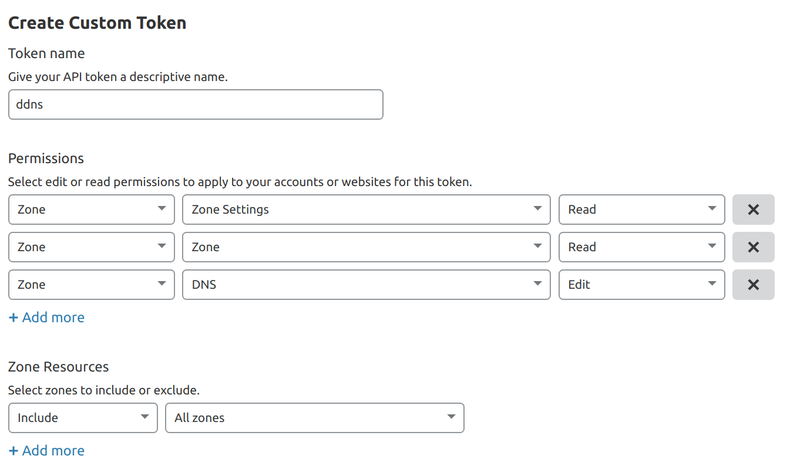

# ACME (Lets Encrypt) Wildcard SSL in Traefik

> **GOAL:** In this document, you'll learn how to set up Wildcard SSL with ACME in Traefik and create a service with HTTP to HTTPS forced redirect.  In all my docs, the end result is a *working example* rather than bullet points and hand-waving.

Like much of the Traefik v2 documentation, the [Official ACME Docs](https://docs.traefik.io/https/acme/) aren't very good.  Hopefully these snippets help.

## Getting Started

Wildcard SSL is great because it lets you manage fewer certificates and spin up new services and new subdomains without dealing with ACME every time.  If you're like me and find ACME (or your own HTTP infrastructure) a little unreliable, then having to interact with it less is a huge positive.

First, Wildcard SSL can only be done using [DNS Challenge Authentication](https://docs.traefik.io/https/acme/#dnschallenge).  To get an SSL certificate for any subdomain, you need to prove ownership of the entire DNS configuration as opposed to any single webserver.  

### DNS Config

Because you're doing DNS Auth, you actually don't *need* a dns record to get the certificate, but you do need one to *test* it.

1. Create a DNS A record to point to your webserver for `whoami.mydoain.com`
1. Verify that your router or firewall is configured to allow 80 AND 443 through the firewall to your webserver.

### Cloudflare API token

> **NOTE** This example uses cloudflare as the [DNS provider](https://docs.traefik.io/https/acme/#providers), you may need to replace my env with your own.

To verify your domain, letsencrypt will use your DNS provider's API to create a `TXT` record with the key `_acme-challenge`.  Then, the ACME auth service will query your DNS settings to see if the record is there, proving you own the domain.

1. Create an API token by going to your profile then clicking the API token tab.  Permissions should look something like this.  I use the same token for `DNS` and `ZONE`, and I think it's probably easiest for you to do the same.
1. If verification fails, look at the traefik logs.  **You may need to manually delete the `TXT` record in your DNS console before trying again.**



### Running Traefik

```bash
export LETSENCRYPT_EMAIL=youremail@domain.com
export CF_API_EMAIL=youremail@domain.com
export CF_TOKEN=your_token
docker run --rm --name traefik \
  --env CF_API_EMAIL=${CF_API_EMAIL} \
  --env CF_DNS_API_TOKEN=${CF_TOKEN} \
  --env CF_ZONE_API_TOKEN=${CF_TOKEN} \
  --volume /var/run/docker.sock:/var/run/docker.sock \
  --volume "/var/lib/traefik/letsencrypt:/letsencrypt" \
  --publish 8080:8080 \
  --publish 80:80 \
  --publish 443:443 \
  traefik:v2.2 \
  --api.insecure=true \
  --providers.docker=true \
  --providers.docker.exposedByDefault=false \
  --entrypoints.web.address=:80 \
  --entrypoints.websecure.address=:443 \
  --certificatesResolvers.myresolver.acme.caServer="https://acme-v02.api.letsencrypt.org/directory" \
  --certificatesresolvers.myresolver.acme.dnschallenge=true \
  --certificatesresolvers.myresolver.acme.dnschallenge.provider=cloudflare \
  --certificatesresolvers.myresolver.acme.email="${LETSENCRYPT_EMAIL}" \
  --certificatesresolvers.myresolver.acme.storage=/letsencrypt/acme.json
```

Let's break down some of these lines.  Anything not mentioned below is unrelated to SSL, but leaving it out may break my examples.

``` bash
# This provides your API information to traefik through environment variables
  --env CF_API_EMAIL=${CF_API_EMAIL}
  --env CF_DNS_API_TOKEN=${CF_TOKEN}
  --env CF_ZONE_API_TOKEN=${CF_TOKEN}
# Your certificates will be written to a JSON file that need to be stored persistently on your host disk. 
  --volume "/var/lib/traefik/letsencrypt:/letsencrypt"
# Use both entrypoints, because you'll need to accept connections on 80 to redirect to 443
  --entrypoints.web.address=:80 \
  --entrypoints.websecure.address=:443 \
# Create a resolver named "myresolver" pointed at the production ACME api
  --certificatesResolvers.myresolver.acme.caServer="https://acme-v02.api.letsencrypt.org/directory" \
  --certificatesresolvers.myresolver.acme.dnschallenge=true \
  --certificatesresolvers.myresolver.acme.dnschallenge.provider=cloudflare \
  --certificatesresolvers.myresolver.acme.email="${LETSENCRYPT_EMAIL}" \
  --certificatesresolvers.myresolver.acme.storage=/letsencrypt/acme.json
```

At this point, **traefik will not generate a cert** because you don't have any services using the `myresolver` resolver yet.

### Running a service

```bash
export MY_APP_DOMAIN=mydomain.com
docker run --rm --name whoami \
  --label traefik.enable=true \
  --label traefik.http.services.my-service.loadbalancer.server.port="80" \
  --label traefik.http.middlewares.my-insecure-redirect-middleware.redirectscheme.scheme="https" \
  --label traefik.http.routers.my-route.entrypoints=web \
  --label traefik.http.routers.my-route.rule="Host(`whoami.${MY_APP_DOMAIN}`)" \
  --label traefik.http.routers.my-route.middlewares="my-insecure-redirect-middleware" \
  --label traefik.http.routers.my-secure-route.entrypoints=websecure \
  --label traefik.http.routers.my-secure-route.rule="Host(`whoami.${MY_APP_DOMAIN}`)" \
  --label traefik.http.routers.my-secure-route.tls.domains[0].main="*.${DNS_DOMAIN}" \
  --label traefik.http.routers.my-secure-route.tls.certresolver="myresolver" \
  --label traefik.http.routers.my-secure-route.tls=true \
  containous/whoami
```

Let's break this config down.

``` bash
# Create an HTTP (insecure) route that only has redirect middleware
  --label traefik.http.services.my-service.loadbalancer.server.port="80" \
  --label traefik.http.middlewares.my-insecure-redirect-middleware.redirectscheme.scheme="https" \
  # This insecure route only listens on the insecure entrypoint
  --label traefik.http.routers.my-route.entrypoints=web \
  # Both secure and insecure need the routing rule
  --label traefik.http.routers.my-route.rule="Host(`whoami.${MY_APP_DOMAIN}`)" \
  # Very important to register the middleware on the route
  --label traefik.http.routers.my-route.middlewares="my-insecure-redirect-middleware" \
# Create an HTTPS (secure) route that references "myresolver" from traefik config
  --label traefik.http.routers.my-secure-route.entrypoints=websecure \
  --label traefik.http.routers.my-secure-route.rule="Host(`whoami.${MY_APP_DOMAIN}`)" \
  # Use your wildcard and NOT the actual domain for domains[0].main.
  --label traefik.http.routers.my-secure-route.tls.domains[0].main="*.${MY_APP_DOMAIN}" \
  # If you ARENT hosting any routes for the bare domain (mydomain.com), you can REMOVE the SAN (Subject Alternative Name)
  # However, leaving it here doesn't hurt anything!
  --label traefik.http.routers.my-secure-route.tls.domains[0].san="${MY_APP_DOMAIN}" \
  --label traefik.http.routers.my-secure-route.tls.certresolver="myresolver" \
  --label traefik.http.routers.my-secure-route.tls=true \
```

Why is https redirect so complicated?  [Nobody seems to know](https://github.com/containous/traefik/issues/4863).

## Summary

You should now be able to access https://whoami.mydomain.com in your browser!
